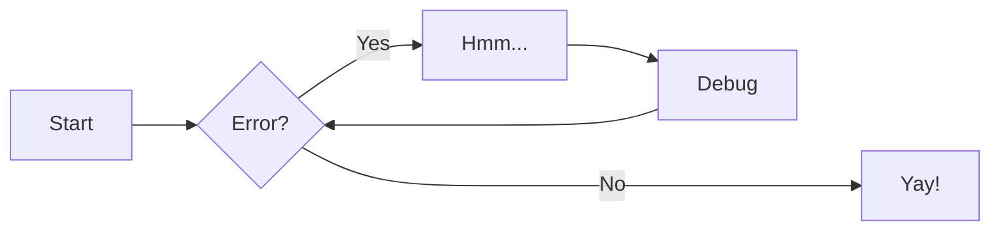

# Arp

<figure markdown>
  { width="900" }
</figure>

```sh
arp -a                               # list of all records
arp -s 192.168.1.2 11:22:33:44:55:66 # add new persist record
arp -d 192.168.1.2 11:22:33:44:55:66 # remove record
```

[Subscribe to our newsletter](https://google.com){ .md-button }
[Subscribe to our newsletter](#){ .md-button .md-button--primary }


```html title="index.html"
<html>
    <head>
    </head>
    <body>
        <div>
            <a></a>
        </div>
    </body>
</html>
```


- [x] Lorem ipsum dolor sit amet, consectetur adipiscing elit
- [ ] Vestibulum convallis sit amet nisi a tincidunt
    * [x] In hac habitasse platea dictumst
    * [x] In scelerisque nibh non dolor mollis congue sed et metus
    * [ ] Praesent sed risus massa
- [ ] Aenean pretium efficitur erat, donec pharetra, ligula non scelerisque



=== "C"

    ``` c
    #include <stdio.h>

    int main(void) {
      printf("Hello world!\n");
      return 0;
    }
    ```

=== "C++"

    ``` c++
    #include <iostream>

    int main(void) {
      std::cout << "Hello world!" << std::endl;
      return 0;
    }
    ```
=== "Bash"
    ```sh
    curl google.com 2>/dev/null; 
    ```


