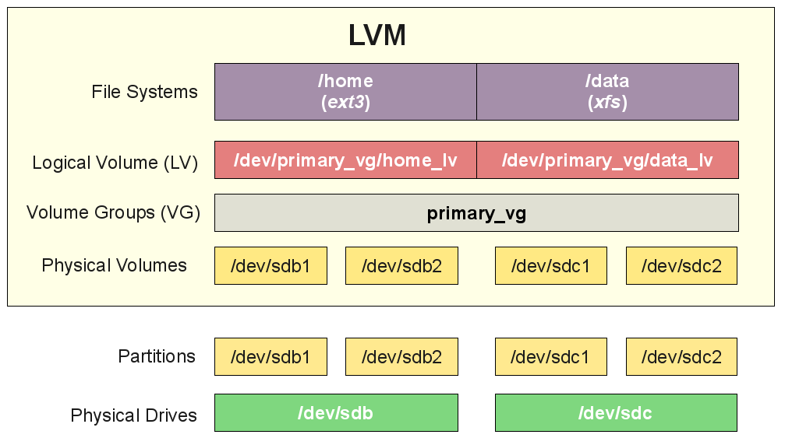

# LVM

## Logical Volume Managment

```yaml

+-- Volume Group --------------------------------+
|                                                |
|    +----------------------------------------+	 |
| PV | PE |  PE | PE | PE | PE | PE | PE | PE |	 |
|    +----------------------------------------+	 |
|      .       	  .    	     . 	      .	       	 |
|      .          .    	     .        .	         |
|    +----------------------------------------+	 |
| LV | LE |  LE | LE | LE | LE | LE | LE | LE |	 |
|    +----------------------------------------+	 |
|            .          .        .     	   .     |
|            . 	        .        .     	   .     |
|    +----------------------------------------+	 |
| PV | PE |  PE | PE | PE | PE | PE | PE | PE |	 |
|    +----------------------------------------+	 |
|                                                |
+------------------------------------------------+


    hda1   hdc1      (PV:s on partitions or whole disks)                        
       \   /                                                                    
        \ /                                                                     
       diskvg        (VG)                                                       
       /  |  \                                                                  
      /   |   \                                                                 
  usrlv rootlv varlv (LV:s)
    |      |     |                                                              
 ext2  reiserfs  xfs (filesystems)                                        
```
## physical volume (PV)
> A physical volume is typically a hard disk, though it may well just be a device that 'looks' like a hard disk (eg. a software raid device). 

## volume group (VG)
> The Volume Group is the highest level abstraction used within the LVM. It gathers together a collection of Logical Volumes and Physical Volumes into one administrative unit. 

## logical volume (LV)
> The equivalent of a disk partition in a non-LVM system. The LV is visible as a standard block device; as such the LV can contain a file system (eg. /home). 

## physical extent (PE)
> Each physical volume is divided chunks of data, known as physical extents, these extents have the same size as the logical extents for the volume group. 

## logical extent (LE)
> Each logical volume is split into chunks of data, known as logical extents. The extent size is the same for all logical volumes in the volume group. 

## mapping modes (linear/striped)
```yaml
+--------------------------------------------------------------------------+
| The administrator can choose between a couple of                          
| general strategies for mapping logical extents onto physical extents:
|
| Linear mapping will assign a range of PE's to an area of 
| an LV in order eg., LE 1 - 99 map to PV1 and LE 100 - 347 map onto PV2.
|
| Striped mapping will interleave the chunks of the logical extents
| across a number of physical volumes eg.,
|
|  1st chunk of LE[1] -> PV1[1],
|  2nd chunk of LE[1] -> PV2[1],
|  3rd chunk of LE[1] -> PV3[1],
|  4th chunk of LE[1] -> PV1[2],
+--------------------------------------------------------------------------+
```

=== "PV"
    ```sh title="Create PV"
    pvcreate /dev/hdb
    ```
    ```sh title="Remove PV"
    pvcreate /dev/hdb
    ```
    ```sh title="Remove from VG"
    pvdisplay /dev/hda1
    vgreduce my_volume_group /dev/hda1 # or pvmove
    ```

=== "VG"
    ```sh title="Create"
    vgcreate my_volume_group /dev/hda1 /dev/hdb1 
    ```
    ```sh title="Remove"
    vgchange -a n my_volume_group
    vgremove my_volume_group
    ```
    ```sh title="Extend"
    vgextend my_volume_group /dev/hdc1 # new physical volume
    ```
    ```sh title="Activate"
    vgchange -a y my_volume_group 
    ```
    ```sh title="Diactivate"
    vgchange -a n my_volume_group 
    ```

=== "LV"
    ```sh title="Create"
    # For linear, size:1500m, name:testlv, from:testvg
    lvcreate -L1500 -ntestlv testvg

    # To create a 100 LE large logical volume with 2 stripes and stripe size 4 KB.
    lvcreate -i2 -I4 -l100 -nanothertestlv testvg

    # If you want to create an LV that uses the entire VG, use vgdisplay to find the "Total PE" size, then use that when running lvcreate.
    vgdisplay testvg | grep "Total PE"
    #> Total PE              10230
    lvcreate -l 10230 testvg -n mylv

    # If you want the logical volume to be allocated from a specific physical volume in the volume group, specify the PV or PVs at the end of the lvcreate command line.
    lvcreate -L 1500 -ntestlv testvg /dev/sdg
        
    ```

    ```sh title="Remove"
    # Removing a logical volume
    umount /dev/myvg/homevol
    lvremove /dev/myvg/homevol
    ```

    ```sh title="Extend"
    lvextend -L12G /dev/myvg/homevol
    lvextend -L+1G /dev/myvg/homevol
    ```

## LVM on three SCSI disk
```sh 
# create PV
pvcreate /dev/sda
pvcreate /dev/sdb
pvcreate /dev/sdc

# create VG
vgcreate my_vg /dev/sda /dev/sdb /dev/sdc

# create LV
lvcreate -L1G -n my_lv my_vg
# or with stripes
lvcreate -L1G -i3 -I4 -n my_lv my_vg 


# Format
mke2fs /dev/my_vg/my_lv

# Mount
mount /dev/my_vg/my_lv /mnt

# Status
df
```