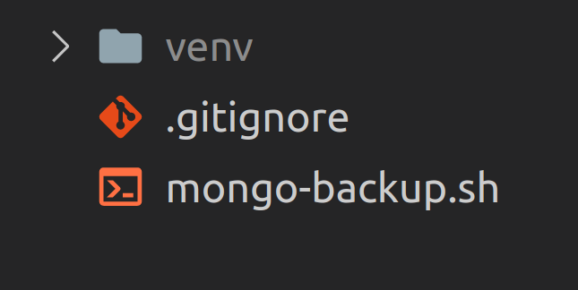

{width=800}


## 📄 Backup Script 
```sh title="Backup script"
#!/usr/bin/bash
#+---------------------------
#| Example :
#|---------------------------
#| MONGO_SERVER
#| mongodump --host 192.168.200.120 --port 27017 -u admin -p XXXXXXXXXX --authenticationDatabase=XXXXXXX --db=XXXXXXX --gzip --archive | ssh ubuntu@backupServer -p22 "cat - > /BACKUP/$(date '+%Y-%m-%d_%H:%M:%S_%p')"
#|
#| BACKUP_SERVER
#| env BACKUP_NUM=8 BUCKET_NAME=XXXXXXXXX SECRET_KEY=XXXXXXXX  ACCESS_KEY=XXXXX HOST=XXXXXX BACKUP_DIR=/BACKUP bash mongo-backup.sh
#+---------------------------

RED='\033[0;31m'
GREEN='\033[0;32m'
YELLOW='\033[0;33m'
BLUE='\033[0;34m'
NC='\033[0m'

log(){
        echo -e "$BLUE `date '+%Y_%m_%d_%H:%M:%S'` $NC $GREEN [LOG] $NC $* $NC"
}


pre(){
   if [ "$EUID" -eq 0 ]
   then log "$RED Please run this script without root permission"
        exit
   fi

   if [ $(dpkg-query -W -f='${Status}' s3cmd 2>/dev/null | grep -c "ok installed") -eq 0 ];
   then
        log "$YELLOW Please Install s3cmd ( apt install s3cmd )"
      # DEBIAN_FRONTEND=noninteractive apt install s3cmd -y;
   fi


sudo tee  ~/.s3cfg > /dev/null <<EOT
[default]
secret_key  = $SECRET_KEY
access_key  = $ACCESS_KEY
host_base   = $HOST
host_bucket = $HOST
use_https   = True

EOT


[[ -z "${BACKUP_NUM}" ]] && log "$YELLOW Please set \$BACKUP_NUM environment" && exit  || BACKUP_NUM="${BACKUP_NUM}"
[[ -z "${BUCKET_NAME}" ]] && log "$YELLOW Please set \$BUCKET_NAME environment" && exit  || BUCKET_NAME="${BUCKET_NAME}"
[[ -z "${SECRET_KEY}" ]] && log "$YELLOW Please set \$SECRET_KEY environment" && exit  || SECRET_KEY="${SECRET_KEY}"
[[ -z "${ACCESS_KEY}" ]] && log "$YELLOW Please set \$ACCESS_KEY environment" && exit  || ACCESS_KEY="${ACCESS_KEY}"
[[ -z "${HOST}" ]] && log "$YELLOW Please set \$HOST environment" && exit  || HOST="${HOST}"
[[ -z "${BACKUP_DIR}" ]] && log "$YELLOW Please set \$BACKUP_DIR environment" && exit  || BACKUP_DIR="${BACKUP_DIR}"

}


upload_to_s3(){
    files="$(ls $BACKUP_DIR)"
    for i in ${files[@]};do
        log "$YELLO upload  $i to s3..."
        s3cmd -c ~/.s3cfg put $BACKUP_DIR/$i s3://$BUCKET_NAME/
        log "$GREEN bakcup ($i) uploaded to s3 successfully"
        rm -f $BACKUP_DIR/$i
        log "$YELLOW $i removed successfully from server"
    done

}

main(){

pre
upload_to_s3

obj_num=$(s3cmd -c ~/.s3cfg ls s3://hasan-test24 | awk '{print $NF}' | wc -l)
log "$YELLOW Number of backups in s3: $obj_num"
if (( obj_num > $BACKUP_NUM));
then
    differ=$(($obj_num - 8))
    log "$RED Number of backups that is higher than $BACKUP_NUM: $differ"
    rm_obj_lst=$(s3cmd -c ~/.s3cfg ls s3://$BUCKET_NAME | awk '{print $NF}' | head -n ${differ})
    for i in ${rm_obj_lst[@]};do
        log "$RED Extra backup: $i"
    done
    log "$YELLOW Removing proccess started"
    for i in ${rm_obj_lst[@]};do
        log "$BLUE $(s3cmd -c ~/.s3cfg rm $i)"
    done
    log "$GREEN $differ backup object removed successfully"
else
    log "$GREEN You don't have extra backup"
fi
}

main

```

## 🥭 Step 1
Run this command on your mongodb server to create backup file and send that to backup server

```sh title="mongodump"
mongodump --host 192.168.200.120 --port 27017 -u admin -p XXXXXXXXXX --authenticationDatabase=XXXXXXX --db=XXXXXXX --gzip --archive | ssh ubuntu@backupServer -p22 "cat - > /BACKUP/$(date '+%Y-%m-%d_%H:%M:%S_%p')"
```

## 🥭 Step 2
Move above script to your backup server and run this command to upload backup files on s3 storage and remove them from server.
```sh title="mongo-backup.sh"
env BACKUP_NUM=8 BUCKET_NAME=XXXXXXXXX SECRET_KEY=XXXXXXXX  ACCESS_KEY=XXXXX HOST=XXXXXX BACKUP_DIR=/BACKUP bash mongo-backup.sh
```